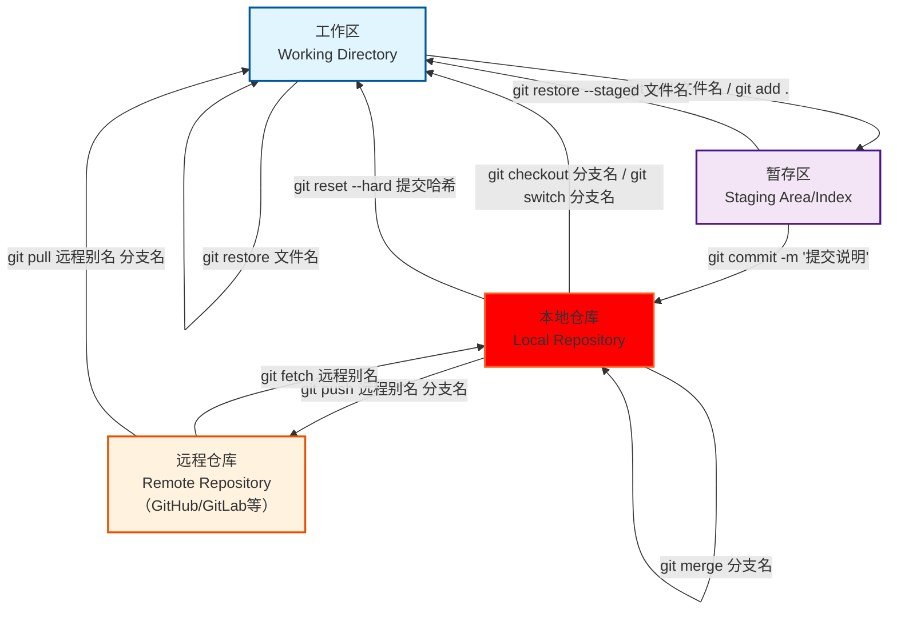

# git 的使用方法

> 一些说明：
> git 流程结构：




## 初始化
```bash
    git init #初始化一个git仓库
```
## 查询状态
```bash
    git status # 查询git仓库状态
    git branch (-v) # 查询分支状态
    git remote -v #查询远程连接
```
## 配置
```bash
    git config --global user.name "your_name"
    git conig --global user.email "xxx@xxx.com" 
```


## **关联github仓库**
```bash
    git remote add <local_branch_name> <http://...>
```
* ATTENTION

    > 此处的local_branch_name仅在执行这个命令的电脑上可用

    > 而remote repositories仍然是master(git默认)或main(github默认) 

        真正改名：
    ```bash
        git branch -M <new_name> # 重命名
    ```
        或
        ` git checkout -b <new_name> `
        ` git branch -D <old_name> `

最后
```bash
`git push <local_branch_name> <new_name> -u
```
## 添加
```bash
git add <file>
git commit (-m "msg")
git push <local_branch_name> 
```

## 拉取

```bash
git fetch
git merge
git pull
```